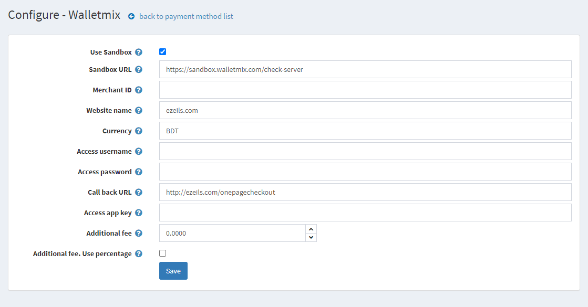

# walletmix

   
  
  
  
  

## Objectives
Walletmix payment gateway allows you to merchandise your products or services online and automatically process credit cards, debit cards or other forms of payment. Walletmix payment gateway service includes security measures that verify each credit card number and intercept potential criminal attempts before a transaction takes place. It has everything from merchant accounts to customized web stores. Walletmix payment gateway is ideal for customers with online wallets. It provides a handful of credit card processing solutions ideal for web and traditional business models.

## Instructions

+ **Installation**
    * Download plugin extension
    * Go to Dashborad » Configuration » Plugins and upload the plugin zip folder
    * Install Walletmix plugin
    
+ **Configuration**
    * Go to Walletmix configuration page
    * Put Walletmix provided creadentials
    * Save configuration

